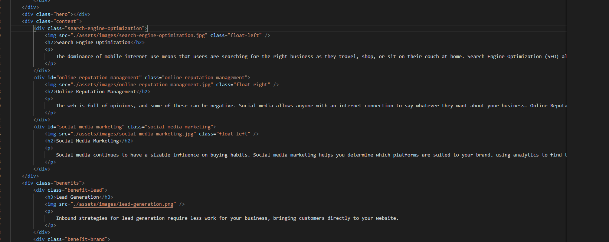
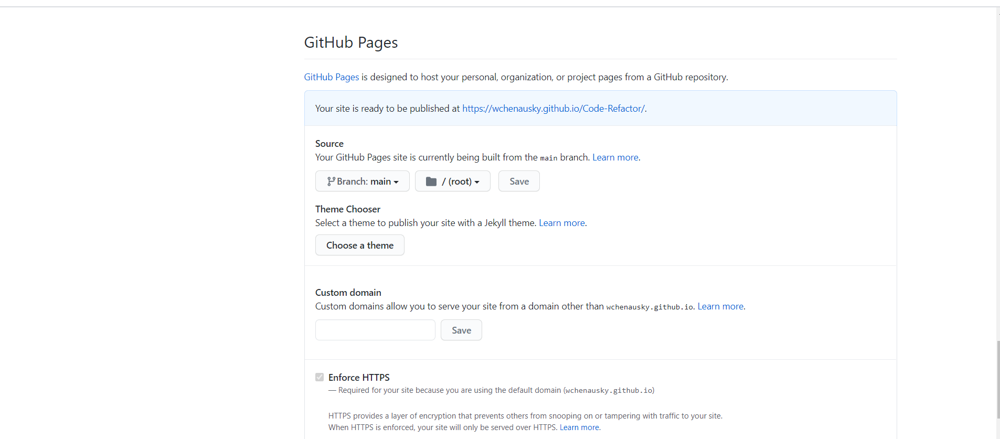

# Code Refactor

I've started this project to help better understand what my day to day work will be like once I'm in the field. Here I have been given a set of HTML and CSS with some errors in them. I will go through step by step of how I fixed these errors and helped clean up some of the undeeded code. As well as giving the website it's own URL.

## Table of Contents
* [Changing Title of Website](#Changing-Title-of-Website)  
* [How To Get The Search Engine Optimization Link To Work](#How-To-Get-The-Search-Engine-Optimization-Link-To-Work)
* [Add Class Tag And Change Existing Class Tag In HTML To Help Consoliate CSS Properties](#Add-Class-Tag-And-Change-Existing-Class-Tag-In-HTML-To-Help-Consoliate-CSS-Properties)
* [Removing divs and adding sections](#Removing-divs-and-adding-sections)
* [Removing divs and adding articles](#Removing-divs-and-adding-articles)
* [Combining CSS Properties For The Class For Services](#Combining-CSS-Properties-For-The-Class-For-Services)
* [Combining CSS Properties For The Class For Benefit](#Combining-CSS-Properties-For-The-Class-For-Benefit)
* [Resize Image "digital-marketing-meeting"](#Resize-Image-"digital-marketing-meeting")
* [Adding alt tags to each image](#Adding-alt-tags-to-each-image)
* [Steps For Giving The Webite A Stand Alone URL](#Steps-For-Giving-The-Webite-A-Stand-Alone-URL)
* [Credits](#Credits)

## Changing Title of Website
1. Change the title of the website to reflect the name of the company

## How To Get The Search Engine Optimization Link To Work
1. I noticed the "Search Engine Optimization" line did not have an id
2. Add the id to navigate to the "search Engine Optimizaion" section.

  

## Add Class Tag And Change Existing Class Tag In HTML To Help Consoliate CSS Properties
1.  Add class tag class=service to search engine opimization
2. Change class tag online-rputation-managment to class=services
3. Change class tag social-media-marketing to class=services

  

## Removing divs and adding sections
1. Identify groups of elements with similar properties.
2. Relabel them as sections instead of divs to allow more accesbility for the user.

  

  

## Removing divs and adding articles
1. Within the sections identify the articles (notice their headers and paragrahs)
2. Change the div to article to allow more understanding to the user.

  

  

## Combining CSS Properties For The Class For Services
1. Combine the class for search-engine-optimization, online-reputation-managment, social-media-marketin to be all inclusive to the class .services
2. Combine the class for search-engine-optimization h2, online-reputation-managment h2, social-media-marketing h2.to be all inclusive to the class .services h2
3. Combine the class for search-engine-optimization img, online-reputation-managment img, social-media-marketing img to be all inclusive to the class .services img.

  

## Combining CSS Properties For The Class For Benefit
1. Combine the class for benefit-lead h3, benefit-brand h3, benefit-cost h3 to benefit-all h3
2. Combine the class for benefit-lead, benefit-brand, benefit-cost to benefit-all
3. Combine the class for benefit-lead img, benefit-brandimg img, benefit-cost img to benefit-all img

  

## Resize Image "digital-marketing-meeting"
1. Resized the image to a lower pixel ratio to reduce loading time.
2. This can be done with most image editors
3. Rename the image as a resize and replace the old image.

## Adding alt tags to each image
1. Add alt tags to each image to help with accessibility for the seeing impaired by sinply using alt= "" with a brief description of what the image is.

  

  

## Steps For Giving The Webite A Stand Alone URL
1. Open Github.com
2. Open the repository for project
3. Open the settings link
4. Scroll down towards the bottom till you see "Git Hub Pages"
5. Set your URL through github using your github username and the name of the project.
6. Click to add a "README.md file"

https://wchenausky.github.io/Code-Refactor/

## Credits

* Marisa NeSmith 
 (https://github.com/marisanesmith)

 * W3 Schools
 (https://www.w3schools.com/)